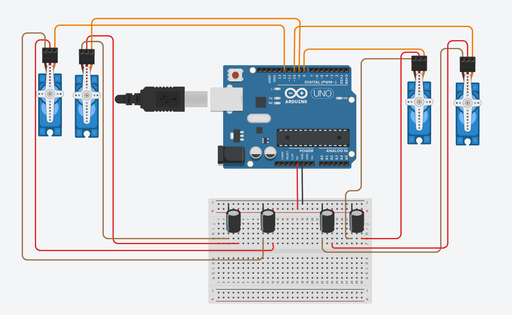

# Arduino-servo-motor
This project uses an **Arduino UNO** board to control **four servo motors** using **four push buttons** connected on a breadboard.

# 🤖 Arduino 4-Servo Motor Control with Push Buttons

This project demonstrates **real-time control of four servo motors** using four push buttons and an Arduino UNO. It is ideal for learning, showcasing embedded systems skills, or building as a foundation for robotics projects.

---

## 📷 Circuit Diagram



---

## 🎥 Demo Video

[](https://youtu.be/6utqb4K-8Sk)

---

## 💾 Full Arduino Code

```cpp
#include <Servo.h>

Servo myservo1;
Servo myservo2;
Servo myservo3;
Servo myservo4;

int button1 = 2;
int button2 = 3;
int button3 = 4;
int button4 = 5;

void setup() {
  myservo1.attach(6);
  myservo2.attach(7);
  myservo3.attach(8);
  myservo4.attach(9);

  pinMode(button1, INPUT_PULLUP);
  pinMode(button2, INPUT_PULLUP);
  pinMode(button3, INPUT_PULLUP);
  pinMode(button4, INPUT_PULLUP);
}

void loop() {
  if (digitalRead(button1) == LOW) {
    myservo1.write(90);
  } else {
    myservo1.write(0);
  }

  if (digitalRead(button2) == LOW) {
    myservo2.write(90);
  } else {
    myservo2.write(0);
  }

  if (digitalRead(button3) == LOW) {
    myservo3.write(90);
  } else {
    myservo3.write(0);
  }

  if (digitalRead(button4) == LOW) {
    myservo4.write(90);
  } else {
    myservo4.write(0);
  }
}
```

---

## 🧰 Components Used

| Qty | Part                 |
|-----|----------------------|
| 1   | Arduino UNO R3       |
| 4   | SG90 Servo Motors    |
| 4   | Push Buttons         |
| 4   | 10kΩ Resistors       |
| 1   | Breadboard & Wires   |
| 1   | 5V Power Supply*     |

*Use an external 5V supply if running all servos at once for best results.

---

## 🚀 How It Works

- Each push button is connected to an Arduino digital input pin (`2`, `3`, `4`, `5`) using the internal pull-up resistor.
- Each servo's signal wire is attached to a PWM pin (`6`, `7`, `8`, `9`).
- Pressing a button moves its corresponding servo to **90°**; releasing returns it to **0°**.
- The design is modular and easy to expand for more servos or sensors.

---

## 📁 Repo Structure

```
.
├── arduino-servo.png     # Circuit diagram image
├── demo.mp4              # Project demo video
├── Servo-code.ino        # Full Arduino source code
└── README.md             # This file
```
---

## 👤 Author

**Your Name Here**  
GitHub: [Safwan Alimam)  
